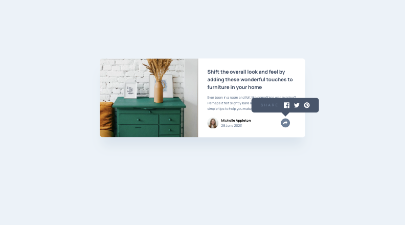
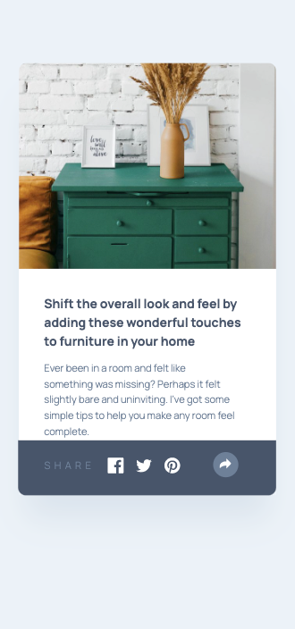

# frontend-project-article-preview-component
 A simple article preview component with a share button built with HTML, CSS, and JS.

## Table of contents

- [Overview](#overview)
  - [The challenge](#the-challenge)
  - [Screenshot](#screenshot)
  - [Links](#links)
- [My process](#my-process)
  - [Built with](#built-with)
  - [What I learned](#what-i-learned)
  - [Continued development](#continued-development)
- [Author](#author)

## Overview

### The challenge

Users should be able to:

Your users should be able to: 

- View the optimal layout for the component on mobile (375px) and desktop (1440px)
- See the social media share links when they click the share icon

### Screenshot

 

### Links

- Solution URL: [https://github.com/judgemongcal/frontend-project-article-preview-component]
- Live Site URL: [https://clinquant-sorbet-d5ce01.netlify.app/]

## My process

My process started with coding all the HTML elements necessary for this project one by one, and styling them with CSS to allow myself to focus on completing one area of the design before I move on with the next one (divide and conquer approach). This structure is also applied in writing CSS, to allow for other people to easily navigate the code. After the HTML and CSS is set, I then proceeded with adding the pop-up function via JS. 

### Built with

- Semantic HTML5 markup
- CSS custom properties
- Flexbox
- Mobile-first workflow
- Responsive Design
- Vanilla JS

### What I learned

Although this project was a simple one, it did gave me a great challenge of learning how to create custom pop-up when the share button is clicked. It also gave me the opportunity to learn new ways to write code and achieve the design requirement.

### Continued development

Moving forward, I will be more mindful in creating responsive designs and I will focus on projects that will require more JS.

## Author

- LinkedIn - [@judgemongcal](https://www.linkedin.com/in/judgemongcal/)
- Frontend Mentor - [@judgemongcal](https://www.frontendmentor.io/profile/judgemongcal)